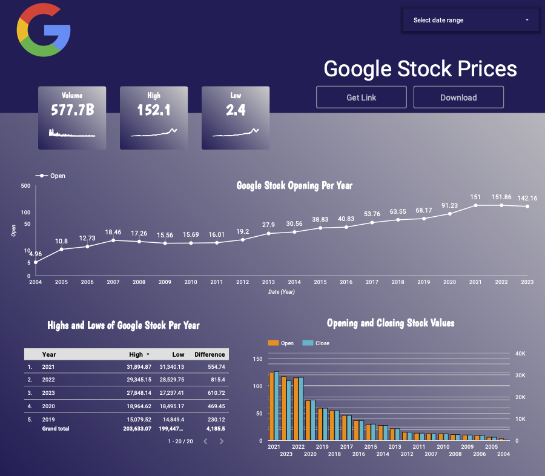

# # My Seventh Code Review: GCloud and Looker Studio

## Alex Wallace

## Description
For this project, I was tasked to create a new dataset in bigquery called 'plants', and create a table called 'flower_shop' with a complete schema. To create the dataset, I used the google cloud console, and to create the tables, I used sql code in bigquery. The sql code I used can be found here [create_table.sql](create_table.sql). I was also tasked to take a public dataset and create a visual for it in looker studio. You can download the dataset at [Google_Stock_Prices](https://www.kaggle.com/datasets/henryshan/google-stock-price). You can view the whole report from looker studio at [Report](https://lookerstudio.google.com/reporting/a4f02e33-71b7-47e5-8cb4-4aad6aa5de74/page/kVLlD). Here is an image of the interactive report here:

I created a date range control for this report, which the user can use to specify a particular date range you want to see in the report. This report has three scorecards showing:
- The overall volume of stocks 
- The high value of the stock for the allotted time period
- The low value of the stock for the allotted time period

It also has a time series with a line graph showing the opening prices per share per year. 

I also created a table showing the max highs, the min lows, and the difference between them per year. I created a new metric called difference by subtracting the 'low' metric from the 'high' metric'.

Lastly, I created a bar chart showing the opening and closing stock prices per year.

I created the foundation for the template I used by following the tutorial here: [template_tutorial](https://measureschool.com/customize-looker-studio-reports/)
 
## Setup/Installation Requirements
In order to set this up, you will need to make a directory for your file and then switch over to that directory. Then, create a virtual environment for python 3 to work in. Change into your virtual environment using source venv/bin/activate. You will need to install the requirements.txt file (pip install -r requirements.txt).

For the sql file, you can run this code using any sql software you'd like. My recommendation would be to use BeeKeeper Studio or Google Cloud Console BigQuery. I used BigQuery to execute my sql code in this project.

## Known Bugs
No known bugs

## License
Copyright 2023 Alex Wallace

Permission is hereby granted, free of charge, to any person obtaining a copy of this software and associated documentation files (the “Software”), to deal in the Software without restriction, including without limitation the rights to use, copy, modify, merge, publish, distribute, sublicense, and/or sell copies of the Software, and to permit persons to whom the Software is furnished to do so, subject to the following conditions:

The above copyright notice and this permission notice shall be included in all copies or substantial portions of the Software.

THE SOFTWARE IS PROVIDED “AS IS”, WITHOUT WARRANTY OF ANY KIND, EXPRESS OR IMPLIED, INCLUDING BUT NOT LIMITED TO THE WARRANTIES OF MERCHANTABILITY, FITNESS FOR A PARTICULAR PURPOSE AND NONINFRINGEMENT. IN NO EVENT SHALL THE AUTHORS OR COPYRIGHT HOLDERS BE LIABLE FOR ANY CLAIM, DAMAGES OR OTHER LIABILITY, WHETHER IN AN ACTION OF CONTRACT, TORT OR OTHERWISE, ARISING FROM, OUT OF OR IN CONNECTION WITH THE SOFTWARE OR THE USE OR OTHER DEALINGS IN THE SOFTWARE.